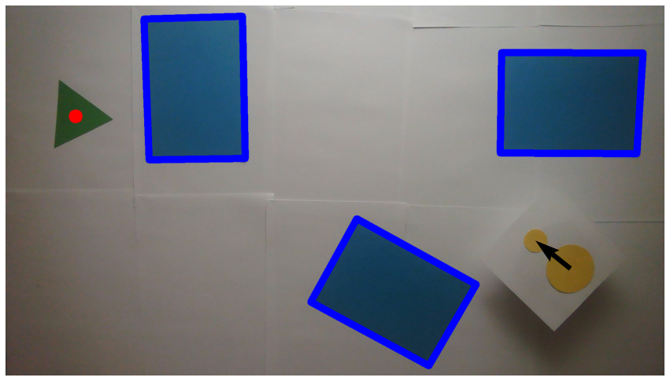
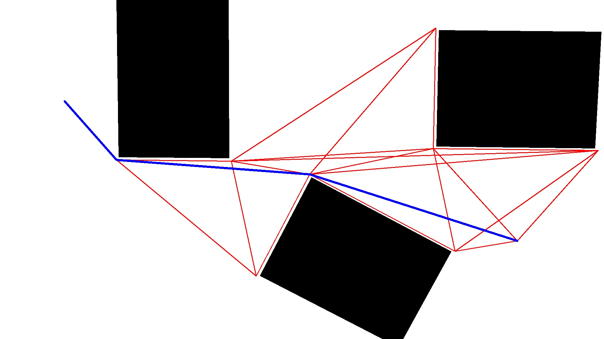
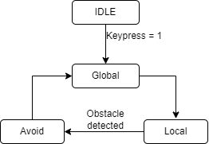
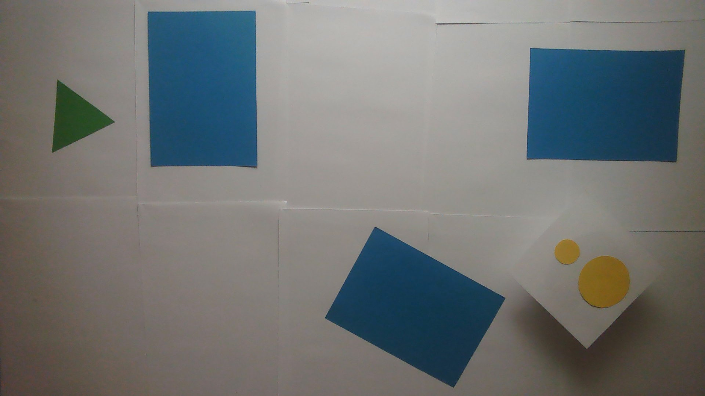
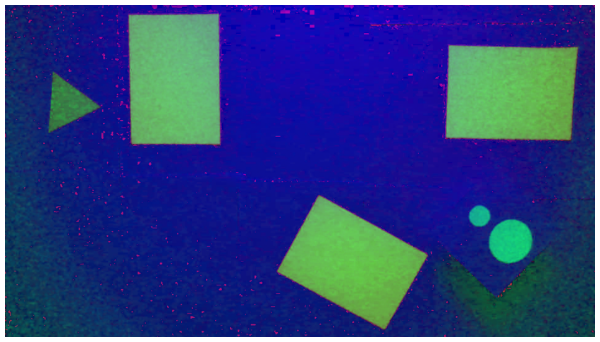
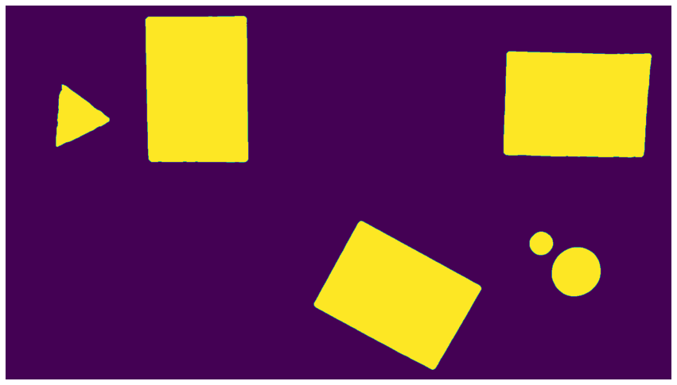
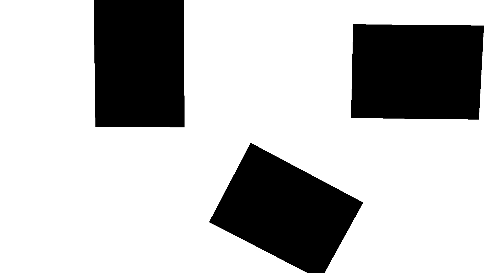
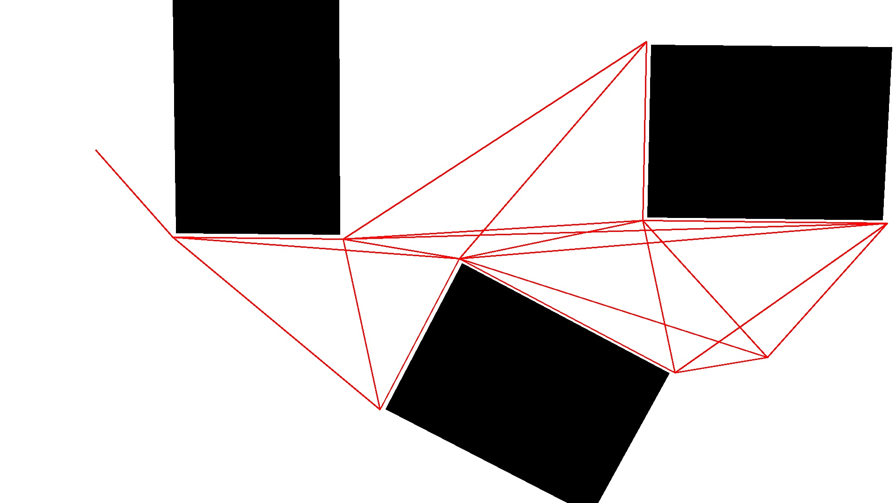

# ThymiAir

Vision-based autonomous navigation for a Thymio II robot using obstacle detection, visibility-graph planning, and EKF-based state estimation.

> EPFL MICRO-452 Mobile Robotics — Group 09, Fall 2022  
> Team: **Albian Salihu**, Marin Bonnassies, Louis Gounot, Alexander Stephan

---
 
## Demo

The arena: blue rectangles are obstacles, the red triangle is the goal, and Thymio is identified by its two colored dots.



The global planner inflates obstacles by the robot radius, builds a visibility graph (red edges), and selects the shortest path (blue line) via Dijkstra:



---

## System Architecture

```
┌──────────────┐   HSV frame    ┌─────────────────┐
│  Overhead    │ ─────────────► │   vision.py     │ → obstacle polygons
│  Camera      │                │                 │ → goal centroid
└──────────────┘                │                 │ → Thymio pose + heading
                                └────────┬────────┘
                                         │
                                ┌────────▼────────┐
                                │ navigation.py   │ inflate obstacles
                                │                 │ visibility graph
                                │                 │ Dijkstra → waypoints
                                └────────┬────────┘
                 odometry                │
                ──────────► ┌────────────▼────────┐
                            │   kalman.py         │ EKF predict + correct
                ◄────────── │                     │ → x_est, P_est
                 camera     └────────┬────────────┘
                                     │
                            ┌────────▼────────┐
                            │   motion.py     │ turn-then-go FSM
                            │   main.py       │ async tdmclient loop
                            └─────────────────┘
```

### Modules

| File | Responsibility |
|---|---|
| `src/vision.py` | HSV colorspace pipeline (went through 15 iterations). Detects obstacles as 4-corner rectangles, goal as a triangle, and Thymio via two colored dots — heading derived from the big→small dot vector. |
| `src/navigation.py` | Inflates each obstacle outward by `THYMIO_SIZE = 140 px` (robot radius). Builds a pixel-by-pixel line-of-sight visibility graph over all inflated corners, start, and goal. Runs Dijkstra for the shortest path. |
| `src/kalman.py` | Extended Kalman Filter with a linearized unicycle motion model. Fuses wheel odometry (predict step) with overhead camera pose (correct step). Runs predict-only when the camera is occluded. |
| `src/motion.py` | `turn()` and `go_to_position()` control functions, proximity-sensor reactive avoidance, async via `tdmclient`. |
| `src/main.py` | Entry point: camera setup, Thymio connection, FSM loop. |

### FSM



| State | Behaviour |
|---|---|
| **IDLE** | Motors stopped; waits for start signal. |
| **Global** | Captures snapshot, runs full vision + path planning pipeline, transitions to Local. |
| **Local** | Executes turn-then-go toward each waypoint; runs Kalman filter every iteration. |
| **Avoid** | Proximity sensors triggered — spins away from obstacle, then returns to Global for re-planning. |

---

## Vision pipeline

| Step | Image |
|---|---|
| Raw camera frame |  |
| HSV conversion |  |
| Saturation binary mask |  |
| All detected markers |  |

---

## Navigation pipeline

| Step | Image |
|---|---|
| Obstacles inflated by robot radius |  |
| Visibility graph (red = all visible edges) |  |
| Shortest path selected by Dijkstra (blue) |  |

---

## Setup

Developed for the original course environment; package versions may need adjustment on newer systems.

**Requirements:** Python 3.8+, Thymio II with Thymio Device Manager running, overhead USB/IP camera.

```bash
pip install -r requirements.txt
```

```bash
cd src
python main.py
```

`CAMERA_INDEX` in `main.py` defaults to `0` — change it if your overhead camera is not the primary device.

---

### Fix example: reproducibility note

```md
This project was developed for a fixed lab setup. Camera calibration, HSV thresholds, marker colors, and robot size assumptions are tuned to the original arena and may need adjustment for a new environment.
```

## Known Limitations

- **Jerky motion** — the turn-then-go FSM performs a full stop-and-rotate before each straight segment; a smooth curvature controller would improve this significantly.
- **Empirically tuned thresholds** — HSV bounds, polygon size ranges, and proximity sensor trigger values were all calibrated to the specific demo arena, lighting, and colored markers used during the course. They will need re-tuning for any different setup.
- **Pixel-space only** — all coordinates are in image pixels with no metric calibration, so absolute distances are approximate.
- **Camera occlusion** — if the Thymio body blocks its own markers (e.g. during a tight turn near an obstacle), the EKF coasts on odometry alone until the markers reappear.

---

## Portfolio note — what was restructured

This repository is a cleaned and modularized version of our original EPFL Mobile Robotics course project. The original submission was notebook-based; for this portfolio version, I reorganized the code into Python modules and improved readability without changing the core algorithms.

**My primary contribution** was the navigation module (obstacle inflation, visibility graph, Dijkstra), with additional work across the vision pipeline, Kalman integration, and the overall system integration in the notebook.
